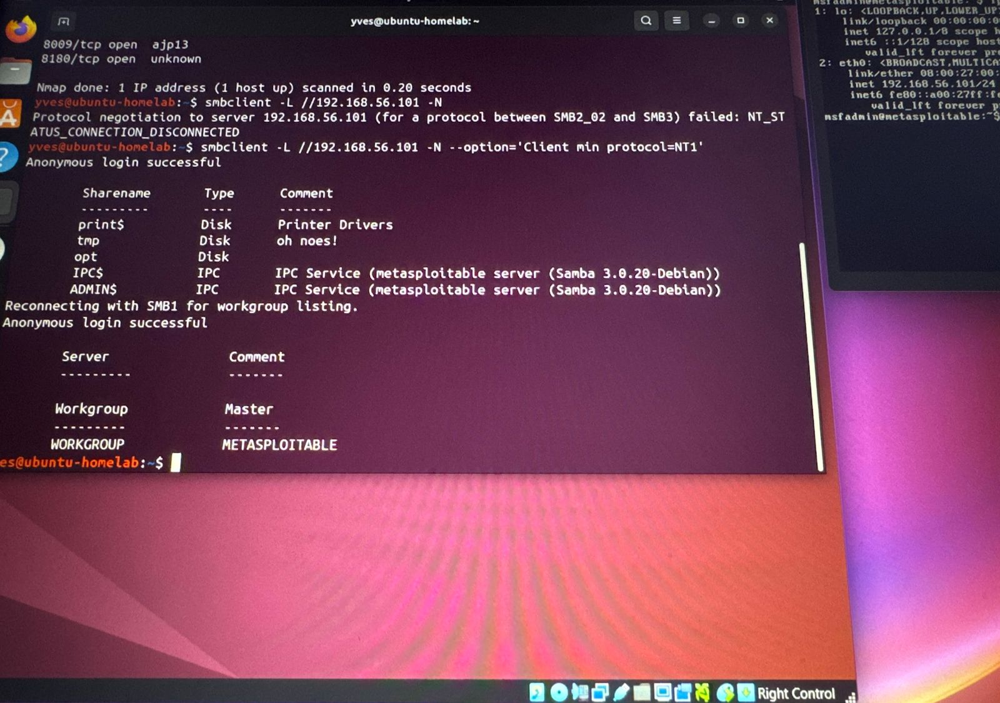

# Metasploitable - SMB Enumeration

## Context
This project is a continuation of the initial reconnaissance phase:

## Objective
Enumerate SMB services and identify accessible shares and a potential misconfiguration.

## Environment
- Attacker Machine: Ubuntu Linux
- Target Machine: Metasploitable 2
- Platform: Oracle VirtualBox
- Network: Host-Only

---

## SMB Enumeration

### Command Used

smbclient -L //192.168.56.101 -N (failed)

smbclient -L //192.168.56.101 -N --option='Client min protocol=NT1'

RESULTS
### First Attempt 
The initial SMB enumeration attempt failed due to a protocol negotiation issue:
### Successful Attempt
After forcing the client to use the SMB1 protocol, the enumeration was successful

Findings
- The first command failed due to a protocol mismatch.
- SMB1 had to be enable manually for compatibility with the target.
- Anonymous login was successful.
- Shared folders were exposed.
- This indicates a potential SMB misconfiguration

Conclusion
The SMB service is accessible without authentication, exposing shared resources. This represents a security risk and could be leveraged for further exploitation.
